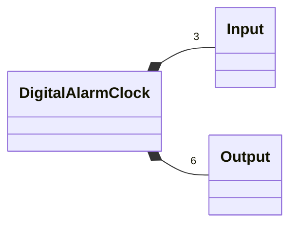
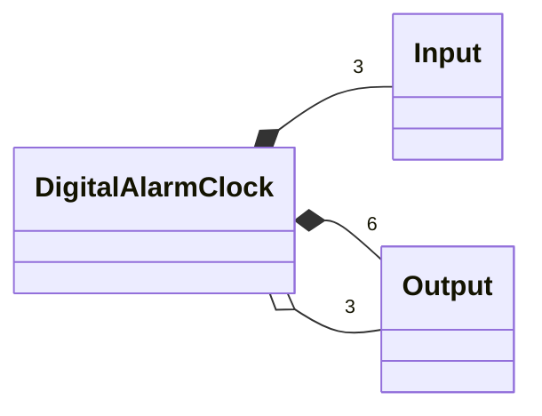
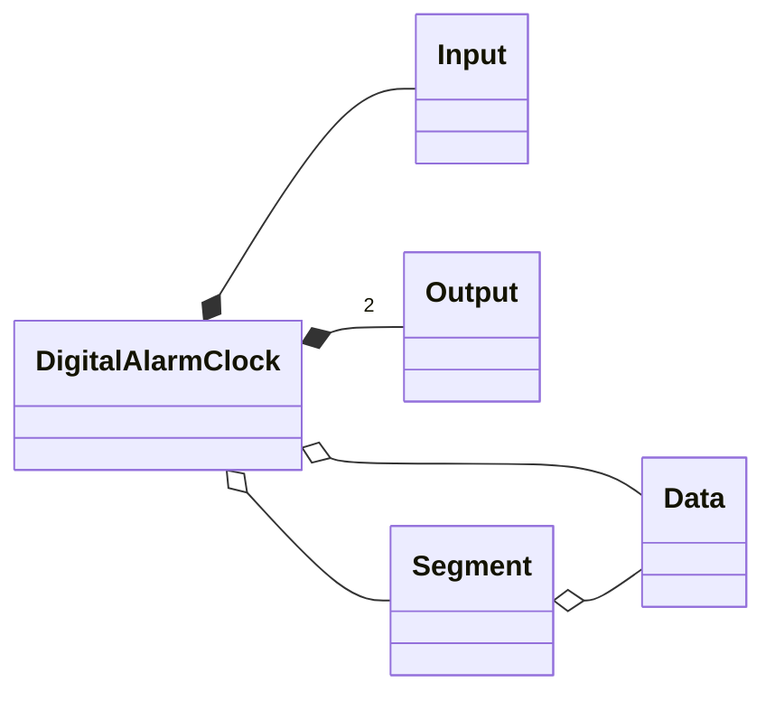
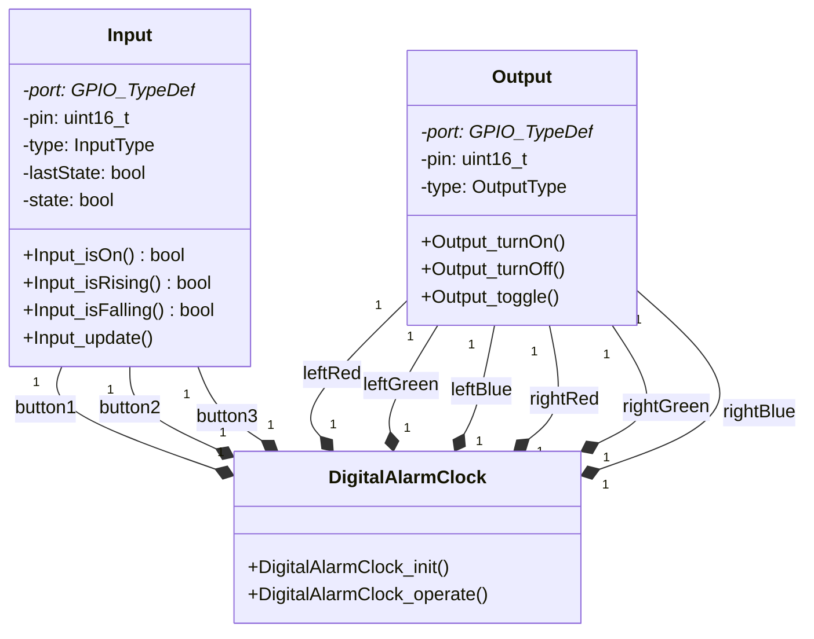

# digital-alarm-clock
# [엠하이브 디지털 알람 시계](https://www.youtube.com/playlist?list=PLUaCOzp6U-Rp6p3XVk9BFsjWsa7bZQDUH)

## [1-1. 버튼 입력으로 LED 토글 1](https://www.youtube.com/watch?v=kQcF4ELYz64)

## [1-2. 버튼 입력 및 UART 입력으로 LED 토글](https://youtu.be/Bg9hrV3UmNI?si=QyxuOjNht088D7Jv)

## [1-3. 버튼 누른 시간 카운트](https://youtu.be/ARtBX-rpjCA?si=GdJaIIyo2OaC4g94)

