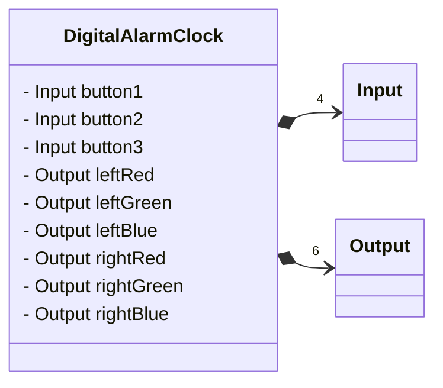

# digital-alarm-clock
# [엠하이브 디지털 알람 시계](https://www.youtube.com/playlist?list=PLUaCOzp6U-Rp6p3XVk9BFsjWsa7bZQDUH)

## [1-1. 버튼 입력으로 LED 토글 1](https://www.youtube.com/watch?v=kQcF4ELYz64)

```mermaid
classDiagram
direction LR

class Input {
}

class Output {
}

class DigitalAlarmClock {
    - Input button1
    - Input button2
    - Input button3
    
    - Output leftRed
    - Output leftGreen
    - Output leftBlue

    - Output rightRed
    - Output rightGreen
    - Output rightBlue
}

DigitalAlarmClock *--> "4" Input
DigitalAlarmClock *--> "6" Output
```
